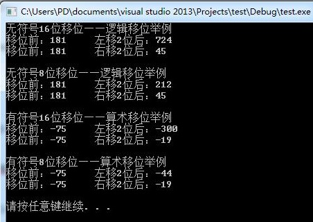

# 移位详解

作者：尹超

日期：2016-7-4

## 背景介绍

本文根据《C和指针》整理而得，并经过VS2013实验验证。如有错误或需要补充，欢迎与本人联系和探讨。

## 知识点

1.	什么是逻辑移位
无论是左移还是右移，空缺部分都是直接补0。移出的位数要么到了更高位，要么直接丢弃。取决于你的数据类型。
2.	什么是算术移位
左移与逻辑移位完全相同，右移的时候空缺位补0还是补1，根据符号位来，如果是正数，则补0，如果是负数，则补1！
3.	对于无符号类型的数据，所有移位操作都是逻辑移位。
4.	对于有符号类型的数据，依据编译器不同而选择到底采用逻辑移位还是算术移位。（所以平台不同会导致移植性问题！）

## 总结
1.	搞清楚到底你现在到底是在逻辑移位还是算术移位（1.有符号数还是无符号数？2.你自己的编译器到底有没有算术移位）
2.	只要移出的数据不被舍弃，无论是逻辑移位还是算术移位都类等于乘除法（这也正是为啥算术右移的时候补的数和符号位一致的原因，否则负数右移移1位岂不是成正数了？刚好可以用这个例子来一劳永逸记住这一点）
3.	很多人喜欢用移位来代替乘除法（显然效率高得多），但是请注意一下你的数据类型，到底是几位的，左移时会不会由于位数不够而高位被舍弃？如果位数不够你试图通过移位来代替乘除法，这就是bug之源！

## 心法口诀
```
无符号来逻辑移，有符号看编译器。
右移看补零和一。左移能否会舍弃？ 
```


## 举例
1.	逻辑移位

原来的数：181(如果数据类型不止8位的话，移出的2位到了更高位)
	
1	0	1	1	0	1	0	1

左移2位后:724（刚好是181*2^2）
	
1	0	1	1	0	1	0	1	0	0
	
右移2位后:45(181/2^2)
	
0	0	1	0	1	1	0	1

原来的数：181(如果数据类型就是8位)

1	0	1	1	0	1	0	1

左移2位后:212(左边被移出的2位被舍弃)	

1	1	0	1	0	1	0	0

右移2位后:45(181/2^2)

0	0	1	0	1	1	0	1

2.	算术移位

原来的数：-75（如果数据类型不止8位，左边高位都是1填充的，这里只列了低八位）
	
1	0	1	1	0	1	0	1

左移2位后: -300 = (-75 * 2^2)		

1	0	1	1	0	1	0	1	0	0

右移2位后:-19 = (-75 / 2^2)

1	1	1	0	1	1	0	1

原来的数：-75（如果数据类型刚好8位）

1	0	1	1	0	1	0	1

左移2位后:-44（左边被移出的2位被舍弃） 		

1	1	0	1	0	1	0	0

右移2位后: -19 = (-75 / 2^2)

1	1	1	0	1	1	0	1


## 实验验证
平台：

VS2013

实验源代码：

```c
#include <stdio.h>
#include <stdlib.h>
void main()
{
	unsigned short a = 181,ta;	//16位无符号整数
	unsigned char b = 181,tb;	//8位无符号整数
	short c = -75,tc;	//16位有符号整数
	char d = -75,td;	//8位有符号整数

	printf("无符号16位移位——逻辑移位举例\n");
	ta = a << 2;
	printf("移位前：%d\t左移2位后：%d\n", a, ta);
	ta = a >> 2;
	printf("移位前：%d\t右移2位后：%d\n\n", a, ta);
	
	printf("无符号8位移位——逻辑移位举例\n");
	tb = b << 2;
	printf("移位前：%d\t左移2位后：%d\n", b, tb);
	tb = b >> 2;
	printf("移位前：%d\t右移2位后：%d\n\n", b, tb);
	
	printf("有符号16位移位——算术移位举例\n");
	tc = c << 2;
	printf("移位前：%d\t左移2位后：%d\n", c, tc);
	tc = c >> 2;
	printf("移位前：%d\t右移2位后：%d\n\n", c, tc);
	
	printf("有符号8位移位——算术移位举例\n");
	td = d << 2;
	printf("移位前：%d\t左移2位后：%d\n", d, td);
	td = d >> 2;
	printf("移位前：%d\t右移2位后：%d\n\n", d, td);
	system("pause");
	return;
}
```

运行结果如图




