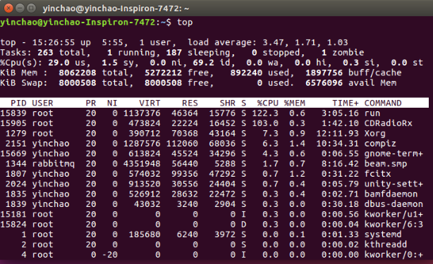

# top命令详解

作者：尹超

日期：2019-6-27

## 概述

top命令经常用来监控linux的系统状况，比如cpu、内存的使用。

下文通过top命令输入后的状态来解释如何查看结果（只介绍最常用的部分，其他请查看链接）

## 前半部分列出系统总体情况

第一行：列出**基本信息**，包括当前系统时间、运行时间、用户数量、平均的进程负载

当前是15:26:55，开机运行了5小时55分， 一个用户，系统在1分钟、5分钟、15分钟下的平均运行进程是3.47个，1.71个，1.03个

第二行：列出**任务状态**，一看都明白不解释

第三行：列出**CPU使用率**， us用户使用率， sy系统内核使用率， id空闲率， wa IO等待占用率， hi硬中断占用率， si软终端占用率

第四行：列出**内存状态**，很明显不解释

第五行：列出swap虚拟内存状态

## 后半部分列出每个任务的详细状态

默认情况如上图所示（可以自定义列出来的项目）

- PID - 进程id
- PR - 进程优先级
- NI - 负值表示高优先级，正值表示低优先级
- VIRT - 使用的内存总量(kB) VIRT = RES + SWAP
- RES - 使用的物理内存(kB) RES = CODE + DATA
- SHR - 使用的共享内存(kB)
- S - 进程状态  D-不可中断的睡眠状态， R-运行， S-睡眠， T-跟踪/停止 Z-僵尸进程
- %CPU - 进程对CPU的占用率
- %MEM - 进程对物理内存的占用率
- TIME+ - 进程已运行的时间
- COMMAND - 进程名称（命令行）

## 自定义详细列表项目

按f键

然后用键盘的上下键移动（不能左右移动）

对感兴趣的item按空格键，可以看到item前面会标上“*”，表示已选中

按esc或者q键返回即可

参考链接

[Ubuntu top命令参数详解](https://blog.csdn.net/qingrenufo/article/details/79076599)

