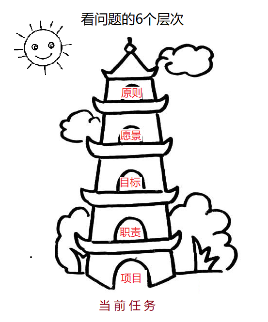

# GTD时间管理

作者：尹超

日期：2019-11-13

## 高效率的精髓 —— 精力管理

核心在于构建自己的“**E - 3C** ”系统

Energy = collect + canendar + concerntrate

## GTD简介

GTD（get things done）是一种行为管理的方法，也是戴维·艾伦写的一本书。

GTD的主要原则在于一个人需要通过记录的方式把头脑中的各种任务移出来。如此则头脑可以不用塞满各种需要完成的事情，而集中精力在正在完成的事情。

## 核心思想

不用GTD：**大脑 = CPU + 硬盘**

使用GTD：**大脑 = CPU；清单 = 硬盘**

## GTD五步骤：

### 1. 收集——清空大脑

把大小事务一股脑塞进收集箱，不要挂念

### 2. 整理——清空收集箱

要领：

- 按顺序处理
- 一次只想一件事
- 永远不要把事务放回收集箱

### 3. 组织

关键是建立清单，将收集箱的事务分门别类，推荐如下5类即可

- 【下一步行动】 —— 最核心，要行动的任务列表【注意排优先级】
- 【等待清单】 —— 被其他事阻塞的，需要等其他状态改变才可以动作的
- 【日程表】 —— 未来确定的事情【约会，杂事】
- 【未来清单】——未来不确定时间的事情
- 【参考资料】

### 4. 回顾与检讨

4.1 每天一次简易回顾，5分钟以内

- 看一眼日程表，确定今天必须搞定的事
- 看一眼下一步行动清单，确定日程之外可以提前搞定的事

4.2 每周一次整体回顾

- 回顾下一步行动清单，干掉已完成的
- 回顾过去一周的日程表，看是否可以转化为下一步行动
- 回顾等待清单和未来清单，看是否可以转化为下一步行动
- 展望下周日程，提前做好准备
- 重新收集大脑中的各色想法和信息，清空大脑，清空收集箱，更新下一步行动清单
- 结果是：把事务安排交给清单，大脑只需要变成CPU一个个解决任务即可

### 5. 执行 —— 选择当下最要紧的事来做

#### 5.1 四象限法帮你忙

- 紧急且重要【马上做】
- 不紧急但重要【多做】
- 紧急不重要【少做】
- 不紧急不重要【不做】

#### 5.2 选择行动方案的三种方法：

确定某一时刻具体行动的四标准：所处情景、有多少时间、有多少经理、重要性

每日工作三分类： 计划内（后台任务）， 临时突发事情（前台中断）， 重新安排 

判断事情重要性——总体检视方法

## 总结：

- 追求心如止水的境界

- 借助清单为大脑减负，使得大脑每次只专注于一件事
- 实现途径是GTD五步法：收集、清空、组织、执行、回顾
- 核心是永远问自己下一步做什么
- 要领是借助清单来管理事务，而非挂念

## GTD辅助工具推荐

[ticktick](https://ticktick.com/)，已经有破解版，手机安装即可使用

## 附录

### 番茄工作法：

一句话说明：把一件事拆成不可中断的25分钟时间片来分段执行

25分钟 = 1个番茄
执行番茄时不可中断，必须高度集中精力。
完成一个番茄时间休息5分钟

该方法的核心思想在于竭尽所能，集中精力
【注意力随时间下降，25分钟是均值，可通过训练来提高，比如冥想】

## 参考资料

[GTD，一套最系统、最全面的时间管理方法](https://www.jianshu.com/p/cfc85e11028d)