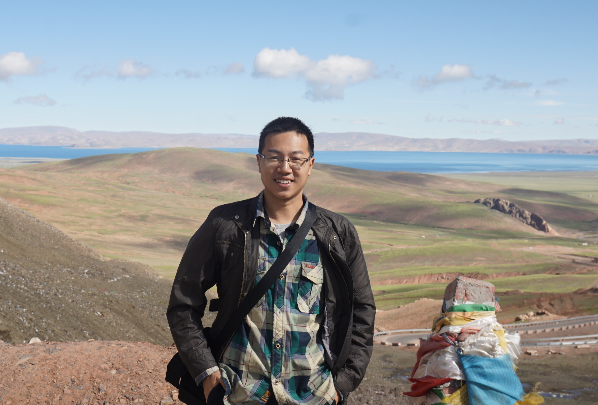
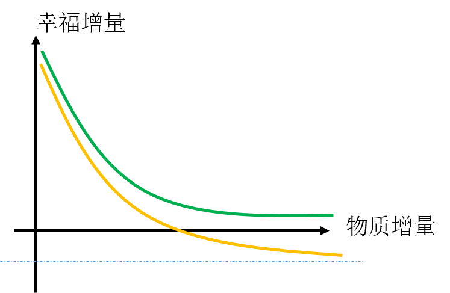
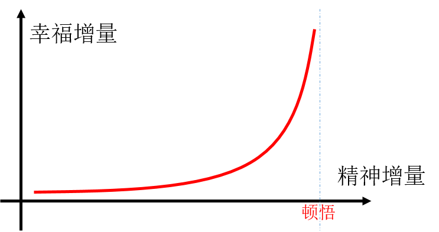

# 作者自述

姓名：尹超

生日：1988.10

职业：软件工程师

## 1. 我是谁

2016.6，那木措旁意气风发的我 ^_^



### 我是湖南人

霸蛮

视诚信如生命

人有点怪，但其实还挺合群，朋友圈中口碑很好

为人正派，追求无上正等正觉的境界（虽然远未达到）

有棱角，会给别人留点情面但仍然当面拒绝别人

无趣，和我在一起不知道说啥好，尴尬

活在自己的世界里，不从众，对外部世界有些冷漠

### 我是工程师

真爱技术，搞技术对我来说比打游戏更有吸引力

各类问题——并不限于工程，在我眼里都是技术活（谈恋爱，炒菜，读书。。。）

碰到感兴趣的或是难题，夜不能寐要去解决

孜孜不倦追求解决问题后的满足感

### 我是阅读爱好者

物质极简，给个猪圈都能活

基本上只买书，希望有一天有人叫我长着两只脚的书虫

一直试图建立属于自己的知识体系【私有GitHub上正在维护】

不认同学海无涯苦作舟，相信学习是快乐且确有方法，并不断探索中

以博学为乐

### 我是烹饪爱好者

对烹饪有特殊爱好，喜欢听食物在油锅里滋滋滋的声音，可以从中获得巨大满足感

喜欢改食谱并做各种奇怪的尝试，乐此不疲

认为烹饪是一门高级艺术：食谱可以自由创造，味道可以自由调和

意识到烹饪和搞项目开发是一回事

- 放准油盐是基础——有专业基础，懂得写简单模块
- 了解味道搭配和食材属性是进阶——初步具有不同领域的视野
- 做出色香味俱全是高级——有系统架构理念，懂得易用性，鲁棒性，可维护性，并发，解耦等高级设计思想
- 综合考量食客的实际情况，合理取舍，什么情况下对方都满意是大师——有产品观念，懂得选择技术路线和开发模式

### 我是投资爱好者

相信通过科学方法，人可以在不需要任何运气的情况下解决财务问题

相信团队的力量可以让上述过程加快并发起了一个小团队定期交流投资心得

认识到投资其实更是一种人性的磨练，投资会放大人性的弱点

## 2. 我的人生观

人作为一种高级动物，既具备动物的自然属性，要吃喝拉撒，有七情六欲；同时又具有人类特有的社会属性，要被尊重认可，要有成就感，要被人爱，要感到幸福。

人的社会属性高于自然属性，而且接受的教育越多，这一点越明显。这决定了受教育水平越高人（并不是学历高）越脱离现实（自然属性）。

### 我的理想人生

```
能和相爱的人在一起，能体会到家庭的温暖
做自己喜欢的事，能体会攻坚克难后的成就感
有和谐的人际关系，常常能和好友嘘寒问暖
活得有价值，有社会认同感，能得到别人的感谢
```

所有这一切高度抽象起来，其实就是**为了获得幸福感**。

据我目前所知，所谓的这种幸福感是内心的一种主观感觉。而人在不同境遇下感受不同；同样客观的事情发生在不同人身上，各人的主观感受也不一样。因此，想要获得美好人生必须从主客观两个方面入手

```
客观上获得更好的物质生活条件
主观上提高对幸福的感知能力
```

### 客观物质条件的改善

我认为是一个如下模型，开始的物质改善会显著增加幸福感，后来慢慢降低，再后来接近消失甚至于起反作用（只可同患难，不可共富贵）



物质生活的改善会增进幸福感显然不必赘述。

关于物质对幸福感提升作用降低的论述：

一方面，广厦千间夜眠仅需六尺，家财万贯日食不过三餐。人的生理结构决定了生存上只能消耗有限资源。财富积累到一定程度后，更多只是为了社会地位等精神方面的需求。

另外一方面，人性就是更关注于相对水平而非绝对水平。这也是为什么同几十年前相比，虽然人们的物质水平极大提高，也不见得大家都过得很开心的原因所在。只要有攀比心存在，物质改善需求就永无尽头。

### 主观幸福感知力改善

我认为是如下模型，开始不得门路，投入很大精力也不见有什么明显效果，但只要坚持住会发现，效果越来越明显。直到达到顿悟一切的境界（佛家所说“无上正等正觉”）



### 结论：

努力工作以改善物质生活水平，努力学习思考以提高对幸福的感知力是通往幸福生活的两大法宝。关键在自己怎么把握，而非客观世界如何变化。

## 3. 我的人生宣言

我的使命是顶天立地活着，并对社会作出贡献，为达成使命我必须：

- 有慈悲心——拥抱人群，不分贵贱，一视同仁热爱每一个人
- 光明磊落——永不做背信弃义，偷鸡摸狗的苟且之事
- 以身作则——做到言行一致，身体力行而不是嘴上说说
- 孜孜不倦——终生学习，与时俱进不被社会抛弃
- 有影响力——有能力可以改善自己和他人的生活

我人生使命角色扮演：

丈夫——老伴是我一生中最重要的人，我甘愿将后背交给她并为她付出一切

儿孙——永不忘亲恩，我会好好孝敬他们，即便他/她已经老糊涂了也不离不弃

父亲——授之以渔，帮助子女尽早认识自我并形成稳定价值观

亲朋好友——我会成为朋友坚实的依靠

陌生人——我不认识他，但我愿意帮他

## 4. 我的人生目标

活过100岁

帮助1万个人过得更好一点

探索出一条可供实践的处世之道
